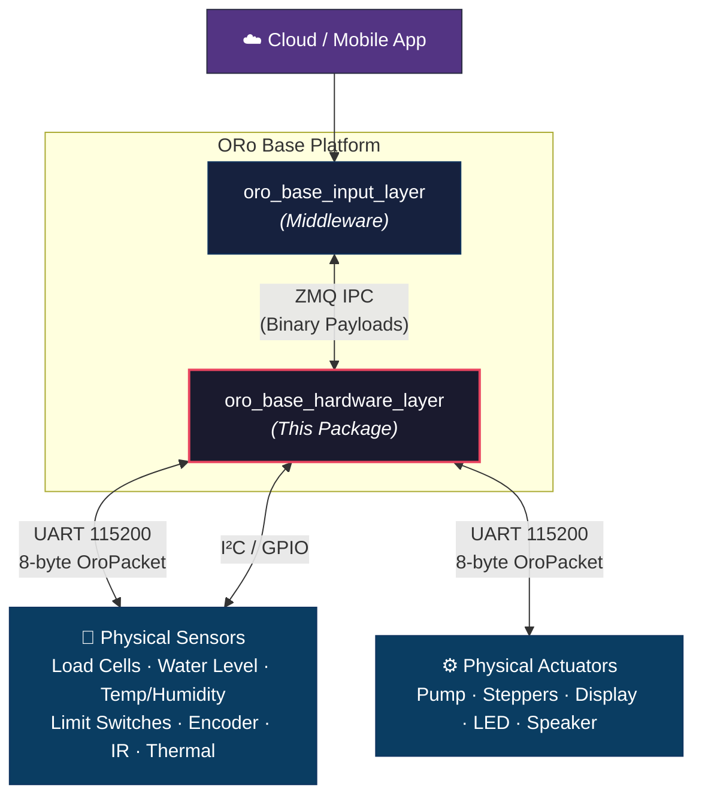
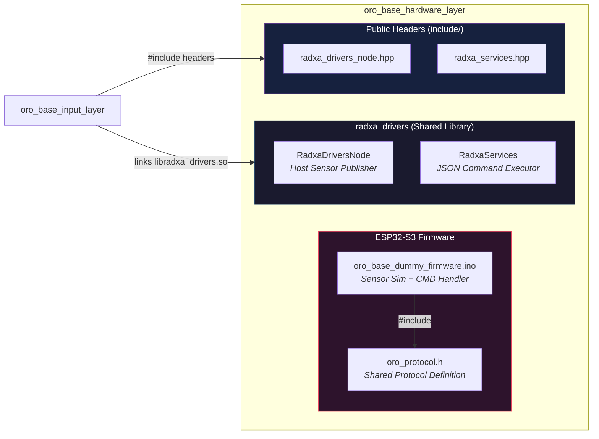
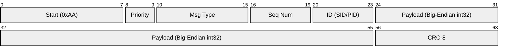
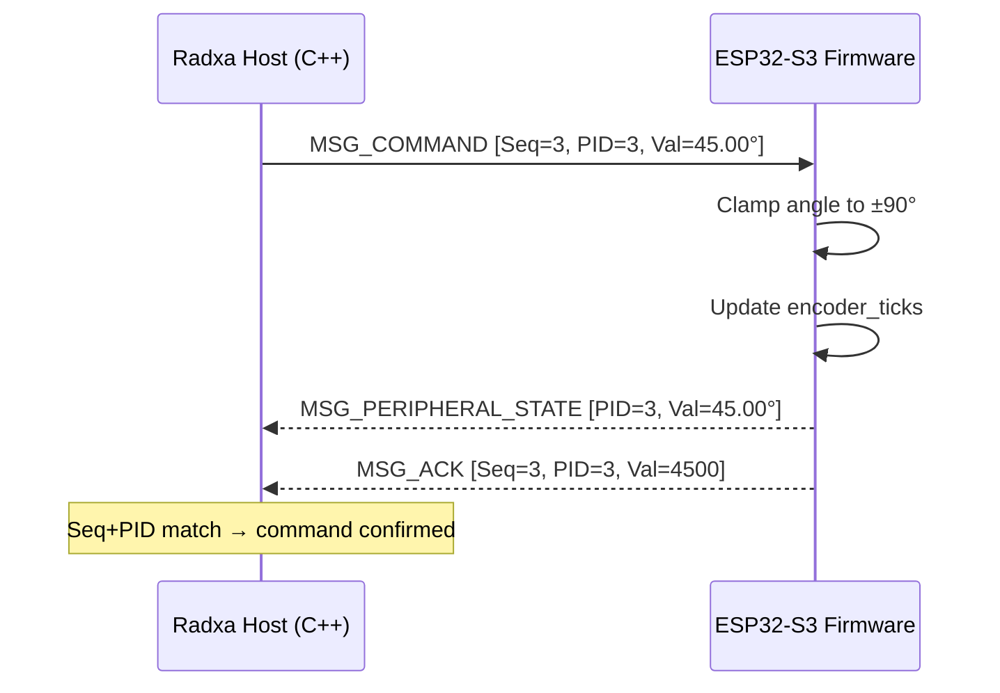
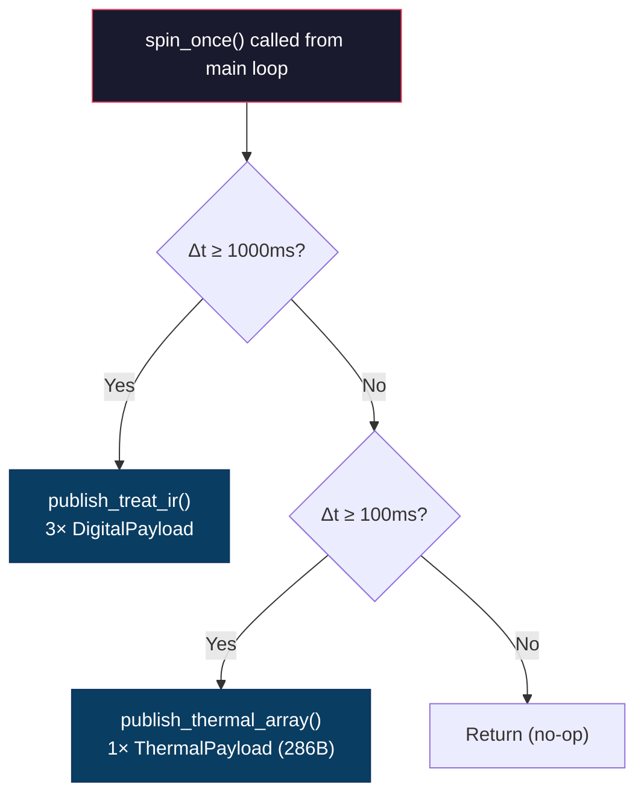
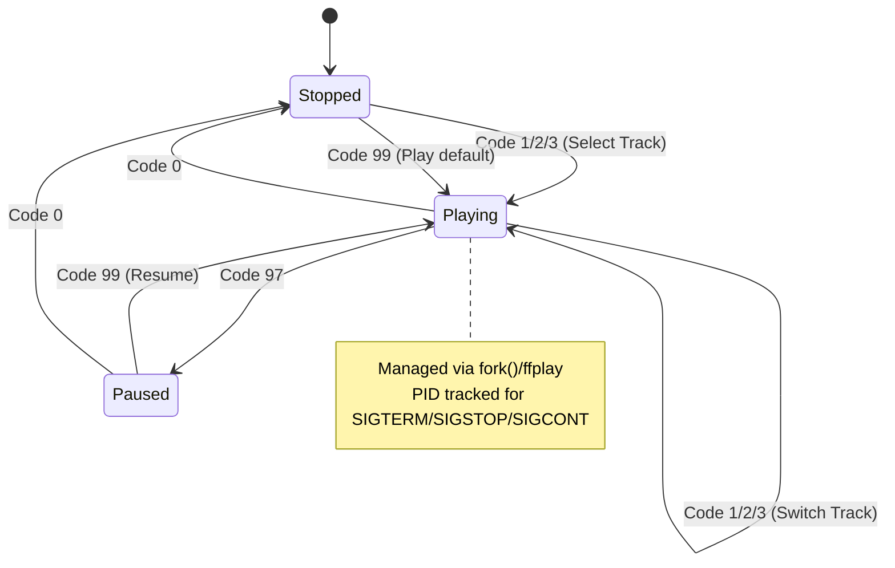
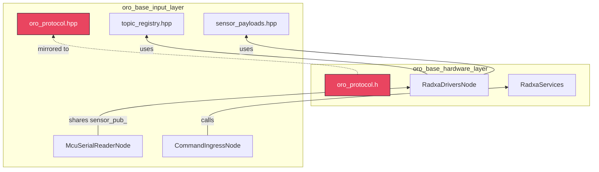

# `oro_base_hardware_layer` — Package Documentation

> **Scope**: Firmware, binary wire protocol, and host-side hardware driver library for the ORo Base platform.

---

## L0 — System Context

The Hardware Layer is the **lowest layer** of the ORo Base stack. It owns everything that directly interfaces with physical hardware: the ESP32-S3 MCU firmware, the binary serial protocol that bridges MCU ↔ Host, and the Radxa SBC's native I²C/GPIO sensor drivers.



### What This Package Does

| Responsibility | How |
|:---|:---|
| Define the binary wire protocol | `oro_protocol.h` — 8-byte fixed-size `OroPacket` with CRC-8 |
| Run MCU firmware | `oro_base_dummy_firmware.ino` — sensor simulation + command handling |
| Drive Radxa-native sensors | `RadxaDriversNode` — I²C thermal array, GPIO treat IRs |
| Execute host-side service commands | `RadxaServices` — audio playback, feed, photo, firmware update |

---

## L1 — Package Architecture

The package is split into **three distinct sub-components**, each with clear ownership boundaries:



### Directory Layout

```
oro_base_hardware_layer/
├── docs/
│   ├── README.md                      ← This file
│   └── protocol_specification.md      ← Wire protocol spec
├── include/
│   ├── radxa_drivers_node.hpp         ← RadxaDriversNode class
│   └── radxa_services.hpp             ← RadxaServices class
├── oro_base_dummy_firmware/
│   ├── oro_protocol.h                 ← 8-byte OroPacket definition (MCU + Host)
│   └── oro_base_dummy_firmware.ino    ← Arduino sketch (ESP32-S3)
└── radxa_drivers/
    ├── CMakeLists.txt                 ← Builds libradxa_drivers.so
    └── src/
        ├── radxa_drivers_node.cpp     ← Thermal/IR sensor simulation & publish
        └── radxa_services.cpp         ← Host command dispatch (audio, feed, etc.)
```

### Build Artifacts

| Target | Type | Dependencies |
|:---|:---|:---|
| `libradxa_drivers.so` | Shared library | `libzmq`, `nlohmann/json` |
| `oro_base_dummy_firmware.ino` | Arduino sketch | Arduino core (ESP32-S3) |

---

## L2 — Component Deep-Dive

### 2.1 ORo Serial Protocol V2 (`oro_protocol.h`)

The single source of truth for MCU ↔ Host wire communication. This header is **duplicated** between the firmware (C) and the host middleware (C++ as `oro_protocol.hpp`) to ensure both sides share identical definitions.

#### Packet Layout (8 bytes, fixed-size)

```
┌───────┬──────────┬────────┬─────────────────────┬────────┐
│ 0xAA  │ msg_type │ id_seq │    value (int32)    │  crc   │
│ 1B    │ 1B       │ 1B     │ 4B (Big-Endian)     │ 1B     │
└───────┴──────────┴────────┴─────────────────────┴────────┘
```



#### Bit-Packed Fields

| Byte | Bits | Field | Encoding |
|:---|:---|:---|:---|
| 1 | `[7:6]` | Priority | `PRIO_LOW(0)` · `MED(1)` · `HIGH(2)` · `CRIT(3)` |
| 1 | `[5:0]` | Message Type | `SENSOR_DATA(1)` · `PERIPHERAL_STATE(2)` · `HEARTBEAT(3)` · `COMMAND(4)` · `ACK(5)` |
| 2 | `[7:4]` | Sequence Number | 4-bit rolling counter (0–15) for command/ACK correlation |
| 2 | `[3:0]` | ID | Sensor ID (SID) or Peripheral ID (PID) depending on msg_type |

#### Sensor IDs (SID) — 4-bit, max 16

| ID | Constant | Signal Type | Description |
|:---|:---|:---|:---|
| `0x00` | `SID_LOAD_LEFT` | Analog | Food bowl 1 weight (fixed-point ×100) |
| `0x01` | `SID_LOAD_RIGHT` | Analog | Food bowl 2 weight |
| `0x02` | `SID_WATER_LEVEL` | Analog | Water tank level |
| `0x03` | `SID_WATER_BOWL` | Analog | Water bowl level |
| `0x04` | `SID_HUMIDITY` | Analog | Ambient humidity % |
| `0x05` | `SID_TEMPERATURE` | Analog | Ambient temperature °C |
| `0x06` | `SID_LIMIT_SW1` | Digital | Camera rotation limit switch 1 |
| `0x07` | `SID_LIMIT_SW2` | Digital | Camera rotation limit switch 2 |
| `0x08` | `SID_ENCODER` | Encoder | Camera rotation ticks (signed) |
| `0x09` | `SID_HOME_SENSOR` | Digital | Camera home position |
| `0x0A` | `SID_POWER_SW` | Digital | Power switch state |
| `0x0B` | `SID_BATTERY` | Analog | Battery level % |
| `0x0C` | `SID_HEARTBEAT` | Digital | MCU alive signal (10s interval) |

#### Peripheral IDs (PID)

| ID | Constant | Description |
|:---|:---|:---|
| `0x00` | `PID_PUMP` | Water pump on/off |
| `0x01` | `PID_LID1_STEPPER` | Feed lid 1 stepper motor |
| `0x02` | `PID_LID2_STEPPER` | Feed lid 2 stepper motor |
| `0x03` | `PID_CAMERA_STEPPER` | Camera rotation stepper (±90°) |
| `0x04` | `PID_DISPLAY` | 7-segment display value |
| `0x05` | `PID_INDICATOR_LED` | Status indicator LED |

#### CRC-8 Integrity

- **Polynomial**: `0x07` (x⁸ + x² + x + 1)
- **Coverage**: Bytes 1–6 (excludes start byte and CRC byte itself)
- **Validation**: `oro_crc8(&pkt.msg_type, 6) == pkt.crc`

#### Value Encoding

| Category | Encoding | Helper |
|:---|:---|:---|
| Analog | `float × 100 → int32 (big-endian)` | `fixed_to_float()` / `pack_value_i32()` |
| Digital | `0` or `1` in LSB of value[4] | `extract_value_i32()` |
| Encoder | Raw signed `int32` ticks | `extract_value_i32()` |

---

### 2.2 ESP32-S3 Firmware (`oro_base_dummy_firmware.ino`)

A **simulation firmware** that emits realistic sensor telemetry over UART at 115200 baud. Designed for end-to-end integration testing without physical sensors.

#### Emission Schedule

```mermaid
gantt
    title Firmware Telemetry Emission Timeline
    dateFormat X
    axisFormat %Ls

    section Fast (1s)
    Load Cells (Bowl 1 & 2)    :0, 1000
    Water Level/Bowl           :0, 1000
    Encoder + Limit Switches   :0, 1000

    section Medium (2s)
    Display Update             :0, 2000
    LED Indicator              :0, 2000

    section Slow (5s)
    Battery / Temp / Humidity  :0, 5000
    State Toggles (Lids/Pump)  :0, 5000

    section Critical (10s)
    Heartbeat                  :0, 10000
```



| Interval | Sensors Published | Priority |
|:---|:---|:---|
| **1s** | Load cells, water levels, encoder, limit switches, power switch | `LOW`–`MED` |
| **2s** | 7-segment display (cycles bowl1/bowl2/tank), LED indicator | `LOW` |
| **5s** | Battery, temperature, humidity, lid/pump toggles | `LOW`–`HIGH` |
| **10s** | Heartbeat | `CRIT` |

#### Simulation Models

- **Food weight**: Sinusoidal 0–500g, phase-offset between bowls
- **Water tank**: Linear drain over time (5L → 0L, repeat)
- **Water bowl**: Sinusoidal 0–1.0L
- **Encoder**: Tracks camera angle (±90°), updated on command
- **Battery**: Linear drain 100% → 0%, slow cycle

#### Command Processing (Host → MCU)

The firmware runs a continuous `processIncomingCommands()` loop that:
1. Scans UART RX buffer for `0xAA` start byte
2. Validates CRC-8 on candidate 8-byte frame
3. Extracts `MSG_COMMAND` packets → dispatches by PID
4. Executes actuator logic (e.g., camera rotation ±90°)
5. Sends `MSG_ACK` with matching sequence number and PID



---

### 2.3 Radxa Drivers Node (`RadxaDriversNode`)

Publishes sensor data from **host-attached peripherals** (I²C, GPIO) that bypass the MCU entirely. Shares the `sensor_pub_` ZMQ PUB socket with `McuSerialReaderNode`.

#### Published Topics

| Topic | Category | Rate | Data |
|:---|:---|:---|:---|
| `/sensors/treat/level_indicator_ir` | Digital | 1 Hz | Treat level IR beam-break |
| `/sensors/treat/sorter_ir` | Digital | 1 Hz | Treat sorter position IR |
| `/sensors/treat/thrower_ir` | Digital | 1 Hz | Treat thrower position IR |
| `/sensors/thermal/ir_array` | Thermal | 10 Hz | 8×8 AMG8833 thermal frame (286 bytes) |

#### Thermal Simulation Model

The thermal array simulates a **moving heat blob** (36.5°C body temperature) on a 22.5°C ambient background using a 2D Gaussian kernel with:
- Bouncing velocity vector within the 8×8 grid
- Per-pixel sensor noise (±0.2°C)
- Frame metadata: ambient temp, min/max, overflow flag



#### ZMQ Wire Format

Each message is a **2-frame multipart ZMQ message**:

| Frame | Content | Example |
|:---|:---|:---|
| Frame 0 (topic) | UTF-8 topic string | `/sensors/thermal/ir_array` |
| Frame 1 (payload) | Binary `ThermalPayload` struct | 286 bytes packed |

---

### 2.4 Radxa Services (`RadxaServices`)

A **static command dispatcher** for host-side operations that don't involve the MCU. Called by `CommandIngressNode` when a JSON command's topic routes to `TopicSource::SYSTEM`.

#### Supported Command Topics

| Topic | Action | Notes |
|:---|:---|:---|
| `/commands/feed` | Dispense food (grams) | Simulated; logs and returns success |
| `/commands/treat/dispense` | Dispense treats (count) | Simulated |
| `/commands/photo_capture` | Capture photo | Simulated |
| `/commands/live_session/start` | Start live video session | Simulated |
| `/commands/live_session/end` | End live video session | Simulated |
| `/commands/camera/ir_control` | Toggle IR illuminator | Simulated |
| `/commands/audio/speakers` | Audio playback control | **Real** — uses `ffplay` via `fork()/exec()` |
| `/commands/settings/apply` | Apply system settings | Simulated |
| `/commands/firmware/update` | Check/apply firmware update | Returns version info JSON |

#### Audio Playback State Machine



#### JSON Request/Response Contract

**Request** (from `CommandIngressNode`):
```json
{ "topic": "/commands/feed", "value": 150.0 }
```

**Response** (to caller):
```json
{
  "status": "success",
  "source": "RadxaCubieA7z",
  "operation": "Feed (Grams)",
  "requested_value": 150.0,
  "completed_at": 1745234567
}
```

---

## Cross-Package Dependencies



> **Key Design Decision**: `oro_protocol.h` (firmware) and `oro_protocol.hpp` (host) are maintained as **separate but identical** definitions. Changes to one must be manually synchronized to the other.
