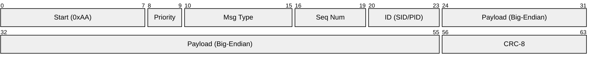
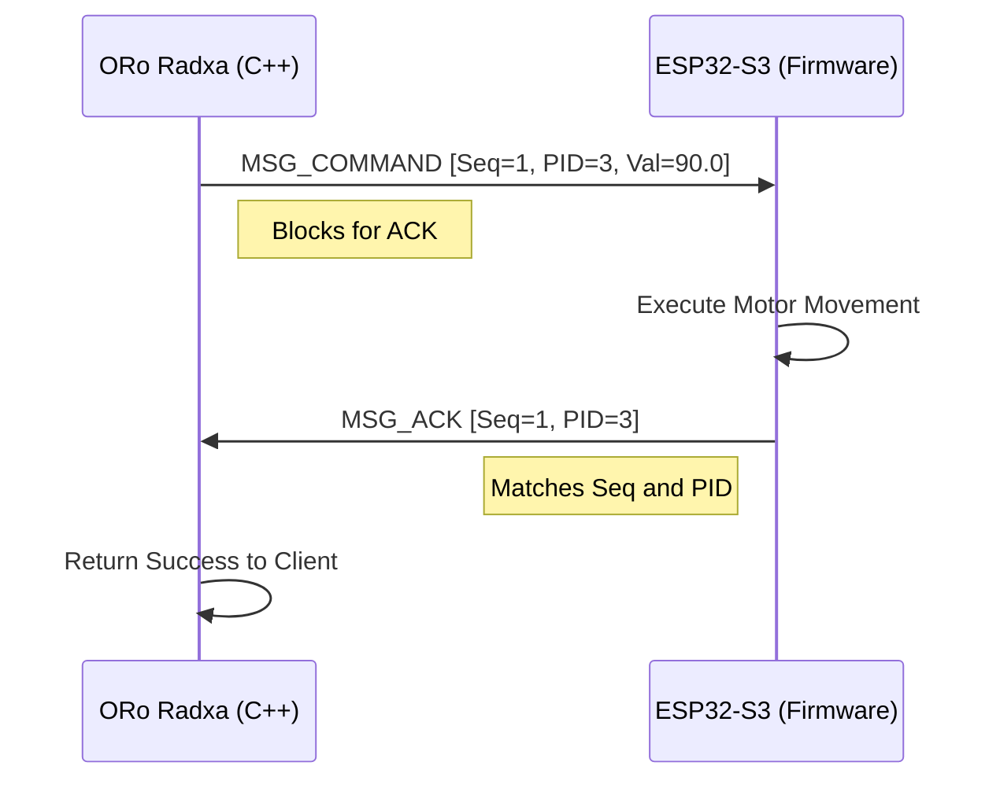

# ORo Serial Protocol V2 - Specification

This document defines the 8-byte fixed-size binary message protocol used for communication between the Radxa host processor and the ESP32 MCU.

## 1. Overview

The protocol is designed for low latency, high reliability, and minimal overhead. Each message is a fixed **8-byte packet** to simplify parsing and prevent fragmentation issues on restricted hardware.

- **Encoding**: Binary (Big-Endian for multibyte payloads)
- **Framing**: Fixed-size (8 bytes)
- **Integrity**: CRC-8 validation

---

## 2. Packet Structure

Each packet consists of 8 bytes (64 bits).

```text
┌───────┬──────────┬────────┬─────────────────────┬────────┐
│ 0xAA  │ msg_type │ id_seq │    value (int32)    │  crc   │
│ 1B    │ 1B       │ 1B     │ 4B                  │ 1B     │
└───────┴──────────┴────────┴─────────────────────┴────────┘
```



| Byte | Field | Format | Description |
| :--- | :--- | :--- | :--- |
| **0** | `Start` | `uint8` | Fixed start-of-frame marker: `0xAA` |
| **1** | `MsgType` | `uint8` | Bit-packed: `[7:6]` Priority, `[5:0]` Type |
| **2** | `ID/Seq` | `uint8` | Bit-packed: `[7:4]` Sequence, `[3:0]` Sensor/Peripheral ID |
| **3-6** | `Value` | `int32` | 4-byte payload. Signed integer or fixed-point (Value * 100). |
| **7** | `CRC` | `uint8` | CRC-8 over bytes 1 through 6. |

---

## 3. Field Definitions

### 3.1 Priority Levels (Byte 1, Bits 7:6)
Priority determines the urgency of the message.
- `0x00` (LOW): Background telemetry (e.g., ambient temperature).
- `0x01` (MED): Normal status updates.
- `0x02` (HIGH): Active commands (e.g., motor rotation).
- `0x03` (CRIT): Emergency stops or critical errors.

### 3.2 Message Types (Byte 1, Bits 5:0)
Identifies the purpose of the packet.
- `0x01`: `MSG_SENSOR_DATA` (Telemetry from SID)
- `0x02`: `MSG_PERIPHERAL_STATE` (Status update from PID)
- `0x03`: `MSG_HEARTBEAT` (Alive signal)
- `0x04`: `MSG_COMMAND` (Request to PID)
- `0x05`: `MSG_ACK` (Confirmation of command)

### 3.3 Sequence Numbers (Byte 2, Bits 7:4)
A 4-bit rolling counter (0–15) used to correlate commands with acknowledgments.

### 3.4 Identifiers (Byte 2, Bits 3:0)
Maps to either a **Sensor ID (SID)** or a **Peripheral ID (PID)** depending on the message type.

#### Common Sensor IDs (SID)
| ID | Name | Description |
| :--- | :--- | :--- |
| `0x00` | `SID_LOAD_LEFT` | Left food bowl load cell |
| `0x01` | `SID_LOAD_RIGHT` | Right food bowl load cell |
| `0x02` | `SID_WATER_LEVEL` | Water tank level sensor |
| `0x05` | `SID_TEMPERATURE` | Ambient temperature |
| `0x0C` | `SID_HEARTBEAT` | System heartbeat |

#### Common Peripheral IDs (PID)
| ID | Name | Description |
| :--- | :--- | :--- |
| `0x00` | `PID_PUMP` | Water pump control |
| `0x03` | `PID_CAMERA_STEPPER`| Camera rotation stepper motor |
| `0x04` | `PID_DISPLAY` | 7-segment display status |

---

## 4. Integrity and Validation

### 4.1 CRC-8 Algorithm
The protocol uses a standard CRC-8 with the polynomial `0x07` ($x^8 + x^2 + x + 1$).

**Validation Range**: CRC is computed over **Byte 1** through **Byte 6** (inclusive). Byte 0 (Start) and Byte 7 (CRC itself) are excluded.

### 4.2 Error Handling
1. **Invalid Start**: If the first byte is not `0x0a`, the receiver shifts the buffer and scans for the next valid `0xaa`.
2. **CRC Mismatch**: The packet is discarded, and the relevant diagnostic counters are incremented.
3. **Sequence Mismatch**: Commands not acknowledged within 500ms are treated as timeouts by the host.

---

## 5. Sequence Flows

### 5.1 Symmetric Command/ACK


