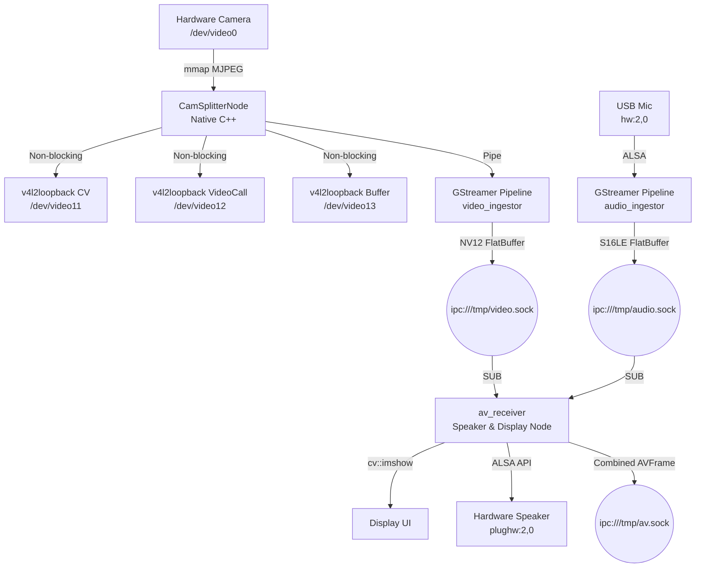

# Radxa A7z Media Middleware

The Radxa A7z Media Middleware is a high-performance, deterministic edge-media ingestion system optimized for the RK3588 SoC. It captures multimodal data (Audio & Video) via hardware-accelerated GStreamer pipelines, serializes it using zero-copy FlatBuffers, and publishes the synchronized frames over low-latency ZeroMQ IPC sockets.

## 🏗️ Architecture

This middleware is built on a distributed microservice architecture to ensure fault isolation, low-latency, and modular scaling.



### Components

- **Video Ingestor (`video_ingestor`)**:
  - Features a high-performance native C++ `CamSplitterNode` that captures raw MJPEG frames from a V4L2 device (e.g., `/dev/video0`) via zero-copy `mmap`.
  - Fans out frames to multiple `v4l2loopback` virtual camera sinks (`/dev/video11-13`) for external applications (e.g. OpenCV scripts, video calls).
  - Bridges the camera feed into a hardware-accelerated GStreamer pipeline using Rockchip MPP (`mppjpegdec`) for JPEG decoding.
  - Publishes `NV12` frames serialized as FlatBuffers over `ipc:///tmp/video.sock`.

- **Audio Ingestor (`audio_ingestor`)**:
  - Captures from an ALSA microphone device (e.g., USB PnP Audio Device).
  - Uses `audioconvert ! audioresample` for dynamic hardware format negotiation.
  - Converts stream to `16000Hz`, `Mono`, `S16LE` PCM.
  - Publishes raw PCM frames serialized as FlatBuffers over `ipc:///tmp/audio.sock`.

- **AV Receiver & Speaker Driver (`av_receiver`)**:
  - Acts as the combined consumer node for synchronized audio and video streams.
  - Receives decoupled streams over ZMQ and dynamically synchronizes them based on `CLOCK_MONOTONIC_RAW` timestamps.
  - Renders low-latency video with real-time HUD overlays (audio VU meter, A/V sync metrics) using OpenCV.
  - Directly drives hardware speakers by pumping synchronized PCM chunks to ALSA devices (e.g., `plughw:2,0`).
  - Re-publishes combined `AVFrame` FlatBuffer payloads over `ipc:///tmp/av.sock` for downstream cognitive modules.

- **Synchronization**: Uses `CLOCK_MONOTONIC_RAW` immediately upon frame capture to provide drift-free correlation between the Audio and Video streams.
- **Serialization Layer**: FlatBuffers (`schemas/video_frame.fbs`, `schemas/audio_frame.fbs`, `schemas/av_frame.fbs`).
- **Configuration**: JSON-based dynamic hardware parameters (`configs/media_config.json`).

---

## 🚀 Installation

### 1. Install Dependencies
Run the provided setup script. It uses `apt-get` to install GStreamer, ZMQ, FlatBuffers, spdlog, JSON, and `v4l-utils`.
```bash
cd scripts
sudo bash setup.bash
```

### 2. Build the Project
We use CMake, which will automatically run the `flatc` compiler against the schema files and generate the C++ headers during the build phase.
```bash
mkdir build
cd build
cmake ..
make -j$(nproc)
```

---

## ⚙️ Configuration

The pipelines read all hardware specifics (device ports, resolutions, framerates) dynamically from `configs/media_config.json`.
Example:
```json
{
  "video": {
    "device": "/dev/video2",
    "width": 3840,
    "height": 2160,
    "framerate_num": 30,
    "framerate_den": 1,
    "zmq_endpoint": "ipc:///tmp/video.sock",
    "hwm": 3
  },
  "audio": {
    "device": "hw:2,0",
    "rate": 16000,
    "channels": 1,
    "format": "S16LE",
    "zmq_endpoint": "ipc:///tmp/audio.sock",
    "hwm": 3
  }
}
```

---

## 🛠️ Troubleshooting & Testing

We provide a script (`scripts/phase1_hardware_tests.sh`) to quickly sanity check your hardware paths before running the C++ executables.

### Common Issues

**1. "WARNING: erroneous pipeline: no element v4l2src / alsasrc"**
- *Cause*: You are likely running from inside an Anaconda environment (`(base)`). Conda uses its own isolated GStreamer installation which is unaware of the `apt-get` plugins.
- *Fix*: Either run `conda deactivate` before building/testing, or force the absolute system path (e.g. `/usr/bin/gst-launch-1.0`).

**2. "Internal data stream error / not-negotiated (-4) in Audio pipeline"**
- *Cause*: The ALSA hardware cannot natively output the exact format requested (e.g., 16000Hz Mono).
- *Fix*: Ensure `audioconvert ! audioresample` is in your GStreamer pipeline before the filter capability (`audio/x-raw,rate=16000...`). The ingestor service handles this automatically.

**3. "No element mppjpegdec" (When running `video_ingestor` on an x86 PC)**
- *Cause*: `mppjpegdec` is a Rockchip-specific hardware decoder for the RK3588. It does not exist on your local x86 Ubuntu machine.
- *Fix*: For local development, edit `src/media/video_ingestor/video_pipeline.cpp` and temporarily replace `mppjpegdec` with `jpegdec`. Remember to change it back before deploying to the Radxa A7z.

**4. Incorrect Hardware Devices**
- *Fix*: Run `v4l2-ctl --list-devices` for Video and `arecord -l` for Audio to find the correct system bindings. Update `configs/media_config.json` accordingly.

---

## 🚀 Launching the Drivers (Bringup)

To launch all the driver nodes simultaneously (similar to a ROS2 launch file), use the `launch_drivers.py` script. This script automatically starts the `video_ingestor`, `audio_ingestor`, and `av_receiver` in the background, prefixes their logs with distinct colors, and gracefully terminates all processes on `Ctrl+C`.

### Usage
```bash
cd scripts
./launch_drivers.py
```

---

## 📺 Live Feed & Synchronization Testing

For quick hardware validation and to see the live video/audio feed synchronized on your desktop, use the `live_feed_test.sh` script.

### Usage
```bash
cd scripts
chmod +x live_feed_test.sh
./live_feed_test.sh
```

### Options inside the script:
The script provides two pre-configured GStreamer pipelines:
1. **Option 1 (MJPG)**: Optimized for high-resolution capture (e.g., 2560x1440). Note that this requires significant CPU for software decoding on x86 systems.
2. **Option 2 (YUYV)**: Optimized for low-latency and low CPU usage by pulling uncompressed frames (e.g., 640x480). This is the smoothest way to test real-time audio/video synchronization on standard laptops.

The script uses `queue` elements to decouple the audio and video threads, ensuring that UI jitter doesn't cause microphone drops.
